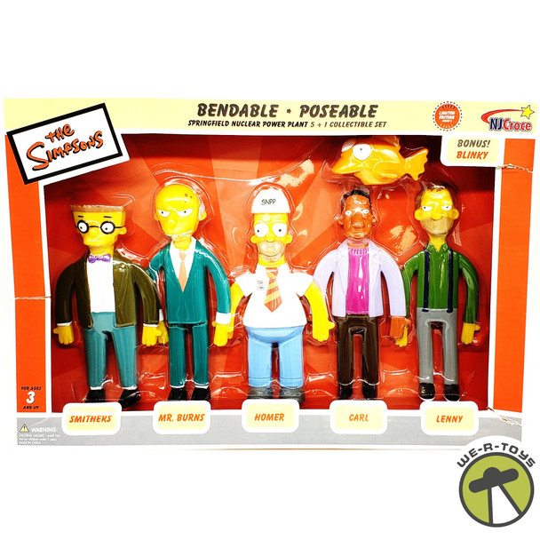

# CARLOS CASTRO ALDROVER 1º DAM

# Springfield Power Plant Employee Management System



## Contexto del Problema

El Sr. Burns, propietario de la Central Nuclear de Springfield, necesita un sistema para gestionar a sus empleados. El sistema debe permitir asignar empleados a diferentes departamentos de la central nuclear y obtener estadísticas.

### Lógica de Negocio

1. La central nuclear tiene diferentes departamentos:
   - Control de Reactor
   - Seguridad
   - Mantenimiento
   - Administración

2. Cada empleado tiene:
   - Nombre
   - Número de identificación
   - Departamento asignado
   - Nivel de experiencia (NOVATO, INTERMEDIO, EXPERTO)
   - Turno de trabajo (MAÑANA, TARDE, NOCHE)

3. El sistema debe permitir:
   - Asignar empleados a departamentos
   - Cambiar el turno de trabajo de un empleado
   - Buscar empleados por departamento
   - Obtener estadísticas de empleados por nivel de experiencia
   - Verificar si un departamento está completamente cubierto en todos los turnos

### Historias de Usuario

1. Crear personas empleadas y asignarlas a departamentos:
2. Visualiza el numero de personas empleadas en plantilla.
   Muestra el listado de empleadas con su info.
3. Buscar empleadas por departamento.
4. Cambio de experiencia de empleada.
4. Obtener estadísticas de empleados por nivel de experiencia
5. Verificar cobertura de turnos por departamento

### Salida por Consola

```sh
=== Springfield Power Plant Employee Management System ===

1. Creando empleados y asignándolos a departamentos...

Empleado Homer Simpson asignado al departamento Control de Reactor
Empleado Lenny Leonard asignado al departamento Seguridad
Empleado Carl Carlson asignado al departamento Mantenimiento
Empleado Smithers asignado al departamento Administración

2. Usuarios creados:

Empleados dados de alta: 4

Homer Simpson (ID: 1, Nivel: NOVATO, Turno: MAÑANA)
Lenny Leonard (ID: 2, Nivel: INTERMEDIO, Turno: TARDE)
Carl Carlson (ID: 3, Nivel: INTERMEDIO, Turno: NOCHE)
Smithers (ID: 4, Nivel: EXPERTO, Turno: MAÑANA)

3. Buscando empleados por departamento...

Empleados en Control de Reactor:
- Homer Simpson (ID: 1, Nivel: NOVATO, Turno: MAÑANA)

4. Cambio de experiencia...

Empleado Carl Carlson cambió su nivel de experiencia a EXPERTO
Empleado Carl Carlson (ID: 3, Nivel: EXPERTO, Turno: NOCHE)

4. Estadísticas por nivel de experiencia:

INTERMEDIO: 1 empleados
EXPERTO: 2 empleados
NOVATO: 1 empleados

5. Verificando cobertura de turnos...

Departamento Control de Reactor: No cubierto en todos los turnos
Departamento Seguridad: No cubierto en todos los turnos
Departamento Mantenimiento: No cubierto en todos los turnos
Departamento Administración: No cubierto en todos los turnos
```

## Componentes

### Clase `EmployeeManagementServiceImpl`

Implementa las operaciones requeridas:
- Creación de empleados
- Cambio de experiencia
- Búsqueda por departamento
- Estadísticas por nivel de experiencia
- Verificación de cobertura de turnos

## Requisitos Técnicos

El sistema debe implementar:

- Uso de Optional para manejar búsquedas de empleados
- Principio de Responsabilidad Única (SRP)
- Principio de Abierto/Cerrado (OCP)
- Inversión de Dependencias (DI) mediante interfaces
- Estructura de datos
- Programación funcional con Stream API
- Estructuras de decisión
- Organización en paquetes
- Método toString para representación de objetos
- Visibilidad adecuada de métodos
- Tipos enumerados para niveles de experiencia, turnos y departamentos.
- Inmutabilidad de objetos
- Conversión de tipos cuando sea necesario 

## Diagrama de clases UML / Arquitectura de la app.

Dibuja en una hoja de papel o con LibreOffice el diagramad de clases UML de la aplicación.


## Prepara el proyecto

 1. Crea un nuevo repo PRIVADO en tu cuenta en **Github** y compártelo con el usuario dfleta.
 2. Crea un nuevo directorio en tu equipo y **clona el repositorio** de Github.
 3. Crea un proyecto **Gradle** o **Maven**.
 4. Pon el proyecto en seguimiento en **Git** y configura `.gitignore`.
 5. Copia y pega la función principal `App.java`. Utilízala como guía en el proceso TDD. Comenta aquellas partes que no hayas implementado.
 6. Completa las clases que aquí se indican **implementando los casos test que necesites**. Practica **TDD**.
 7. **Realiza `commits` como mínimo cada vez que termines una historia de usuario**. Sin commit periódicos, no corrijo el examen.

## Entrega

 1. Crea un repo PRIVADO en tu GitHub y compártelo con el usuario dfleta.
 2. **Realiza commits periódicamente** mientras avanzas en el desarrollo de la aplicación. Sin commit periódicos, no corrijo el examen.
 3. Realiza un `push` al repo remoto en GitHub **SÓLO cuando hayas terminado el proyecto**.